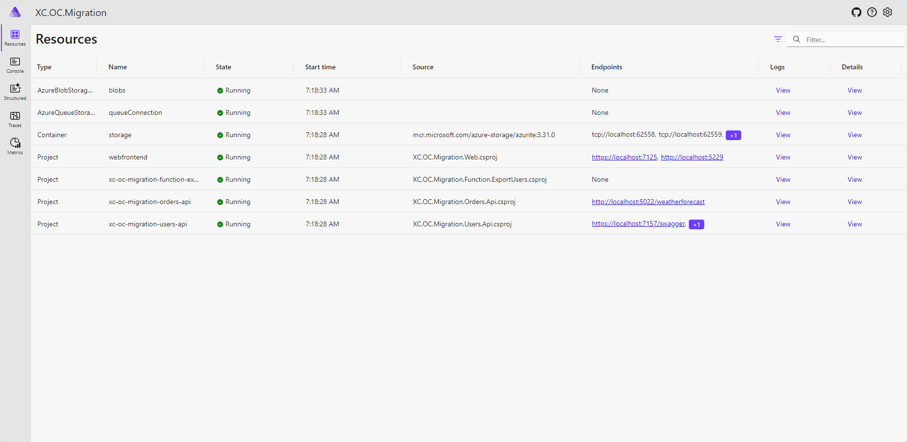
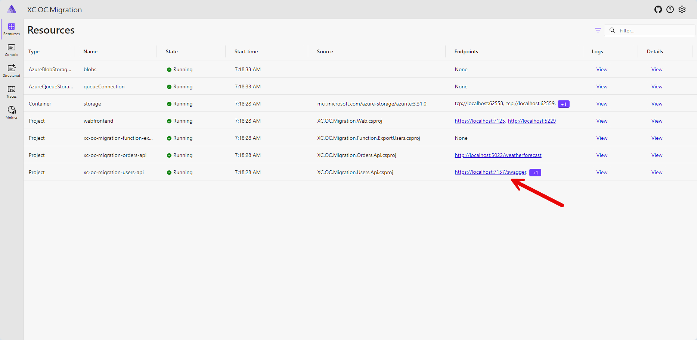

#### Introduction

This code repository provides the implementation of the following features:

- Export Sitecore User along with Experience Commerce Entity (The users data export is very generatic and you must modify the code to include the data you want to export according to your project requirements)

#### Implementation

The code is implemented using the .NET Aspire. The .NET Aspire is a set of powerful tools, templates, and packages for building observable, production ready apps. Read more about [.NET Aspire](https://learn.microsoft.com/en-us/dotnet/aspire/get-started/aspire-overview).

I've tried to follow clean architecture as much as possible and I will keep refactoring the code in future.

#### Requirements

The following are the requiremnts your system meet to run the code.

- Docker (You must run this in the Linux containers mode)
- .NET 8 SDK
- Visual Studio 2022 Community/Professional/Enterprise or Visual Studio Code or Jetbrains Rider

#### How to run the code

1. Clone the repository.
2. Open the solution in the Visual Studio / Visual Studio Code / Jetbrains Rider.
3. Expand functions\XC.OC.Migration.Function.ExportUsers project.
4. Open the local.settings.json file and set the connection string values according to you environment setup.
5. Set the XC.OC.Migration.AppHost project as the start up project and run/debug the project using https profile.
6. When you run the project it will open the dashboard page in the browser.
7. Open the xc-oc-migration-users-api endpoint. 
8. Run the /users/export endpoint in the Swagger UI with the following input.

```
{
  "userNamePrefix": "storefront",
  "startDate": "2017-01-01",
  "endDate": "2024-01-01",
  "pageSize": 300,
  "applicationName": "sitecore",
  "fileNamePrefix": "users"
}
```

9. Once the input received, the `xc-oc-migration-function-exportusers` function will execute and export the users data.
10. The exported data will be stored in the Azure Blob storage. Please note when you run this project on local, the Azure Blob storage, Azure Queue all are of short life till your project is running. For the actual data export, you must configure the Azure Storage account.
